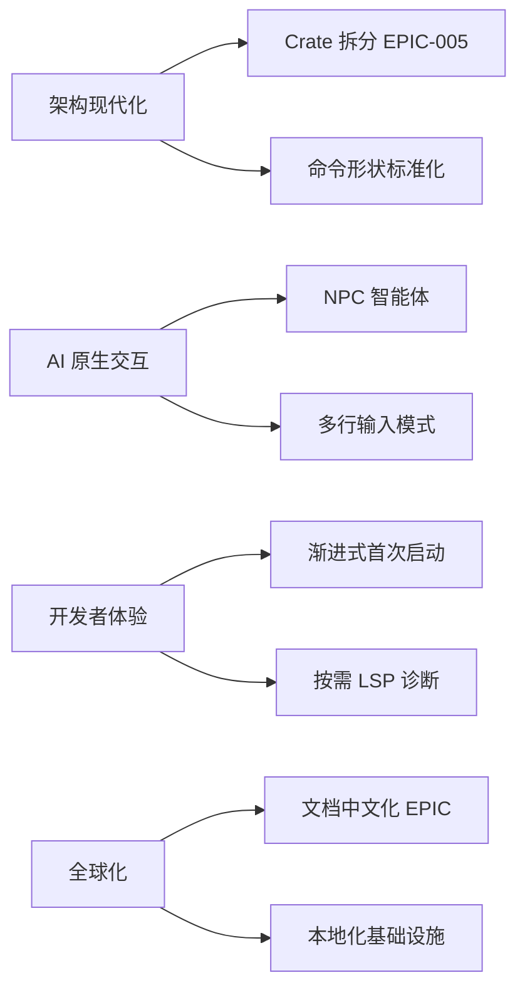

# AI CLI 工具社区动态日报 2026-08-21

> 生成时间: 2026-08-21 03:30 UTC | 覆盖工具: 10 个

- [Claude Code](https://github.com/anthropics/claude-code)
- [OpenAI Codex](https://github.com/openai/codex)
- [Gemini CLI](https://github.com/google-gemini/gemini-cli)
- [GitHub Copilot CLI](https://github.com/github/copilot-cli)
- [Kimi Code CLI](https://github.com/MoonshotAI/kimi-cli)
- [OpenCode](https://github.com/anomalyco/opencode)
- [Pi](https://github.com/badlogic/pi-mono)
- [Qwen Code](https://github.com/QwenLM/qwen-code)
- [DeepSeek TUI](https://github.com/Hmbown/DeepSeek-TUI)
- [Grok Build](https://github.com/xai-org/grok-build)
- [Claude Code Skills](https://github.com/anthropics/skills)

---

## 横向对比

# AI CLI 工具生态横向对比分析报告 | 2026-08-21

---

## 1. 生态全景

当前 AI CLI 工具生态呈现**"标准化撕裂与平台化收敛"并存**的格局：AGENTS.md 跨工具配置标准获近 5K 点赞（Claude Code #6235），但厂商锁定（CLAUDE.md vs AGENTS.md）仍是核心张力；**Windows 平台体验**成为全行业共同短板，Codex、Claude Code、Pi 均有高热度 Windows 专属 Issue；**MCP 生态**从协议层快速向认证、沙箱、跨端同步等工程纵深演进，但稳定性债务同步累积；多代理（Multi-agent）交互进入可视化时代（Codex `codex agents` 仪表盘），标志工具从"对话式"向"编排式"跃迁。

---

## 2. 各工具活跃度对比

| 工具 | 今日 Issues 更新 | 今日 PR 更新 | 版本发布 | 核心动态 |
|:---|:---:|:---:|:---|:---|
| **Claude Code** | 10+ 热点 Issue | **0**（停滞） | v2.1.238 | PR 活动冻结，模型质量危机（#77136, 319👍）与 AGENTS.md 标准化议题关闭 |
| **OpenAI Codex** | 10 个热点 Issue | **10 个** | rust-v0.149.0 稳定版 + 4 个 alpha | 密集发布，`codex agents` 仪表盘上线，Windows 路径问题集中爆发 |
| **Gemini CLI** | 10 个热点 Issue | 10 个 PR | v0.56.0-nightly | Agent 可靠性（静默失败）与评估基础设施为核心 |
| **GitHub Copilot CLI** | 12 个新增 Open，20+ 关闭 | **1 个** | v1.0.81-6 预览版 | 修复密集，MCP 生态整合与企业合规为主轴 |
| **Kimi Code CLI** | **2 个** | **1 个** | 无 | 活跃度最低，聚焦插件安全文档与子代理资源泄漏 |
| **OpenCode** | 10 个热点 Issue | 10 个 PR | v1.18.19 | 网关兼容性补丁，流中断恢复与 Windows 并行优化 |
| **Pi** | 10 个热点 Issue | 10 个 PR | 无 | Windows 支持战略讨论（36 评论），TUI 精细化打磨 |
| **Qwen Code** | 10 个热点 Issue | 10 个 PR | v0.21.15 + 2 个 nightly | Aone Code 企业集成 7 Issue 井喷，review 循环收敛架构级改进 |
| **DeepSeek TUI/CodeWhale** | 7 个 Issue | 5 个 PR | v0.9.10（品牌迁移） | 架构重构（EPIC-005 crate 拆分）与品牌升级并行 |
| **Grok Build** | — | — | — | **24 小时无活动** |

> **活跃度分层**：Codex/OpenCode/Qwen Code/Pi 为第一梯队（PR/Issue 双高）；Claude Code 出现 PR 冻结异常信号；Kimi/Grok Build 活跃度显著落后。

---

## 3. 共同关注的功能方向

| 功能方向 | 涉及工具 | 具体诉求与数据 |
|:---|:---|:---|
| **🔥 Windows 平台体验平等化** | Claude Code、Codex、Pi、OpenCode、Copilot CLI | Codex 3 个独立 Issue 指向 `\\?\` 长路径前缀（#39130, #39209）；Claude Code 进程死锁（#42776, 125 评论）；Pi 每击键重绘（#6300）；OpenCode 并行会话 CPU 优化（#42980, +88.2% 吞吐） |
| **🔥 MCP 生态健壮性** | Claude Code、Codex、Copilot CLI、Gemini CLI | 认证刷新缺失（Codex #17265, 57👍）；跨会话死锁（Claude #86012）；服务端灰度回滚（Claude #88370）；OAuth 令牌桥接断裂（Copilot #4096） |
| **🧠 模型输出质量/可控性** | Claude Code、Qwen Code、Gemini CLI | Claude 修辞重复（#77136, 319👍）；Qwen review 循环收敛（#9278）；Gemini 技能系统"冷启动"（#21968） |
| **🛡️ 安全沙箱精细化** | Claude Code、Copilot CLI、Gemini CLI、Qwen Code | 沙箱过度限制（Copilot #4524）；macOS Seatbelt 逃逸防护（Gemini #28935）；代码执行权限决策（Qwen #9556）；敏感文件泄露（OpenCode #33228） |
| **📊 会话/记忆持久化** | Copilot CLI、Qwen Code、Codex、Kimi | `store_memory` 回归（Copilot #4535）；长会话内存泄漏（Qwen #2128）；token-budget 历史恢复（Codex #39827）；Kimi Memory Plus 提案（#2613） |
| **🔧 跨工具配置标准化** | Claude Code、OpenCode、Pi | AGENTS.md vs CLAUDE.md（Claude #6235, 4929👍）；OpenCode 加载 `~/.claude/skills`（#43747）；Pi 命令别名统一（#5340 等） |

---

## 4. 差异化定位分析

| 工具 | 功能侧重 | 目标用户 | 技术路线特征 |
|:---|:---|:---|:---|
| **Claude Code** | 深度 IDE 集成、模型能力优先 | 专业开发者、Anthropic 生态用户 | **闭源模型绑定**，CLAUDE.md 厂商锁定策略；终端交互优化（readline 键位） |
| **OpenAI Codex** | 多代理编排、企业云集成 | 企业级用户、AWS/Azure 混合云 | **Rust 核心 + 多代理仪表盘**；Bedrock/云厂商深度适配；快速迭代（alpha 通道密集） |
| **Gemini CLI** | Agent 可靠性、评估驱动开发 | Google 生态、重视可观测性的团队 | **"正确失败"优先于成功执行**；评估基础设施（eval infra）投入密度最高 |
| **GitHub Copilot CLI** | 企业合规、MCP 生态整合 | Copilot Business/Enterprise 用户 | **微软生态锁定**，企业策略引擎（托管策略、权限模式）；修复响应快但创新保守 |
| **Kimi Code CLI** | 插件生态、长期记忆 | Moonshot 国内用户、MCP 扩展开发者 | **最轻量活跃**，MCP 协议实验性扩展；安全文档先行于功能 |
| **OpenCode** | 多模型网关、开源透明 | 多 provider 切换用户、自托管需求 | **最大模型生态覆盖**（DeepSeek/GPT/GLM/Qwen）；社区驱动，自动化贡献者（bot）深度参与 |
| **Pi** | TUI 极致体验、跨工具迁移友好 | 终端原生用户、Claude Code 迁移者 | **TUI 精细化标杆**；命令别名兼容（/exit /quit /bye）；硬件光标、主题系统等细节打磨 |
| **Qwen Code** | 企业代码评审、阿里生态集成 | Aone/Codeup 用户、中文企业开发者 | **Review 循环收敛**架构级创新；内部工作流（Aone Code）驱动；安全门硬化 |
| **DeepSeek TUI/CodeWhale** | 架构现代化、AI 原生交互 | Rust 生态贡献者、创新交互探索者 | **品牌重构中**；NPC 智能体提案；crate 拆分工程债清偿 |
| **Grok Build** | — | — | **活动停滞**，战略状态不明 |

---

## 5. 社区热度与成熟度

### 社区热度矩阵

| 维度 | 领先者 | 说明 |
|:---|:---|:---|
| **Issue 讨论深度** | Claude Code #6235 (4929👍)、Pi #7547 (36 评论) | 标准化议题与平台战略级讨论 |
| **PR 迭代速度** | Codex（10 PR/日）、Qwen Code（10 PR/日） | 功能密集交付 |
| **修复响应效率** | Copilot CLI（20+ Issue/日关闭） | 企业级 SLA 驱动 |
| **创新实验密度** | Codex（alpha 通道）、Gemini（nightly） | 快速验证新交互范式 |
| **自动化贡献** | OpenCode（opencode-agent[bot] 4 PR/日） | 需关注代码审查流程匹配 |

### 成熟度阶段判断

| 阶段 | 工具 | 标志 |
|:---|:---|:---|
| **平台化成熟期** | Copilot CLI、Claude Code | 企业合规、权限体系完善，但创新放缓（Claude PR 冻结异常） |
| **快速迭代期** | Codex、OpenCode、Qwen Code、Gemini CLI | 功能密集、架构级改进并行，稳定性债务累积 |
| **架构重构期** | DeepSeek TUI、Pi | 技术债清偿（crate 拆分）、品牌/定位调整 |
| **生态建设初期** | Kimi Code CLI | 插件安全基线、协议扩展能力待建立 |
| **停滞/观望期** | Grok Build | 24 小时零活动，战略优先级存疑 |

---

## 6. 值得关注的趋势信号

| 趋势信号 | 来源证据 | 对开发者的参考价值 |
|:---|:---|:---|
| **AGENTS.md 标准化不可逆** | Claude Code #6235 关闭（4929👍）、Codex 已支持、OpenCode 加载 `~/.claude/skills` | **配置迁移策略**：优先采用 AGENTS.md，避免深度绑定厂商私有格式；关注 Anthropic 正式回应 |
| **"静默失败"成为可靠性核心指标** | Gemini #22323（子代理超时报告成功）、Qwen #9573（恢复误报）、Claude #77136（质量退化无感知） | **可观测性投资**：工具链需暴露内部状态（遥测、轨迹日志），而非仅依赖最终输出判断 |
| **Windows 从"支持"到"平等体验"的范式转移** | 全行业 Windows Issue 密度异常，OpenCode #42980 量化性能优化（CPU -48.4%） | **选型权重调整**：Windows 开发者应优先评估 Codex（路径问题社区已定位）、OpenCode（并行优化）、Pi（战略讨论活跃） |
| **服务端灰度变更的"信任危机"** | Claude #88370（无客户端更新致 MCP 失效） | **架构韧性设计**：关键 workflow 需客户端侧降级开关，避免依赖单一服务端稳定性 |
| **评估基础设施（Eval Infra）成为竞争壁垒** | Gemini #24353（76 行为用例）、Qwen #9278（review 遥测驱动） | **质量可信>功能丰富**：选型时关注工具的测试覆盖率、回归检测能力，而非仅看功能清单 |
| **多代理从"功能"到"可视化编排"** | Codex `codex agents` 仪表盘、Qwen review 循环收敛架构 | **工作流设计变革**：开发者需适应"代理即服务"的编程模型，关注状态机设计与错误传播 |
| **安全从"合规检查"到"架构默认"** | Qwen #9584（CVE 硬阻断）、Gemini #28935（macOS Seatbelt）、Codex #39837（项目信任级别） | **供应链安全**：插件/第三方 MCP 工具的权限模型、凭证注入机制需纳入安全审计 |

---

*报告基于 2026-08-21 各工具 GitHub 公开数据生成，适合技术决策者评估工具选型、开发者识别生态演进方向。*

---

## 各工具详细报告

<details>
<summary><strong>Claude Code</strong> — <a href="https://github.com/anthropics/claude-code">anthropics/claude-code</a></summary>

## Claude Code Skills 社区热点

> 数据来源: [anthropics/skills](https://github.com/anthropics/skills)

# Claude Code Skills 社区热点报告（2026-08-21）

---

## 1. 热门 Skills 排行（按社区关注度）

| 排名 | Skill / PR | 功能 | 讨论热点 | 状态 |
|:---|:---|:---|:---|:---|
| 1 | **[skill-creator 评估修复](https://github.com/anthropics/skills/pull/1298)** | 修复 `run_eval.py` 的 recall 计算、Windows 流读取、触发检测及并行工作器问题 | 核心基础设施缺陷，10+ 独立复现，直接影响所有 Skill 开发者的评估准确性 | 🟡 Open |
| 2 | **[document-typography](https://github.com/anthropics/skills/pull/514)** | AI 生成文档的排版质量控制：孤行/寡行预防、编号对齐 | "AI 生成文档的排版问题影响每一份输出，但用户很少主动要求"——切中隐性痛点 | 🟡 Open |
| 3 | **[ODT Skill](https://github.com/anthropics/skills/pull/486)** | OpenDocument 创建、模板填充、ODT↔HTML 转换 | 开源/ISO 标准格式支持，对标现有 DOCX/PDF skill 的格式覆盖缺口 | 🟡 Open |
| 4 | **[self-audit](https://github.com/anthropics/skills/pull/1367)** | 机械验证 + 四维推理质量门控（文件存在性→安全性→正确性→优雅性） | 通用型质量保障 skill，作者后续还提出了 [三阶段流水线提案](https://github.com/anthropics/skills/issues/1385) | 🟡 Open |
| 5 | **[frontend-design 改进](https://github.com/anthropics/skills/pull/210)** | 提升前端设计 skill 的可操作性和单轮对话可执行性 | Skill 设计的最佳实践讨论：指令粒度、token 效率、避免"教人类而非教 AI" | 🟡 Open |
| 6 | **[testing-patterns](https://github.com/anthropics/skills/pull/723)** | 全栈测试指南：Testing Trophy、AAA 模式、React 组件测试、E2E | 测试策略 skill 的体系化尝试，覆盖"测什么/不测什么"的决策框架 | 🟡 Open |
| 7 | **[ServiceNow 平台 Skill](https://github.com/anthropics/skills/pull/568)** | 企业级 ServiceNow 全模块覆盖：ITSM/ITOM/SecOps/FSM/SPM/CSDM 等 | 最广度的企业垂直领域 skill，8 月仍在更新，显示持续维护意愿 | 🟡 Open |
| 8 | **[pyxel 复古游戏开发](https://github.com/anthropics/skills/pull/525)** | Pyxel MCP 服务器集成，Python 像素艺术/8-bit 游戏工作流 | 创意开发场景，作者 kitao 即为 Pyxel 引擎维护者，生态原生的 skill 设计 | 🟡 Open |

---

## 2. 社区需求趋势（Issues 提炼）

| 方向 | 代表 Issue | 核心诉求 |
|:---|:---|:---|
| **🔒 安全与信任边界** | [#492](https://github.com/anthropics/skills/issues/492) (43 评论) | 社区 skill 冒用 `anthropic/` 命名空间的供应链攻击风险，需官方签名/验证机制 |
| **🏢 组织级 Skill 共享** | [#228](https://github.com/anthropics/skills/issues/228) (16 评论, 👍8) | 企业内 Skill 库的原生共享，替代 Slack 传文件的手动流程 |
| **🛠️ Skill 开发工具链** | [#556](https://github.com/anthropics/skills/issues/556) (12 评论) | `run_eval.py` 等核心工具的跨平台可靠性（Windows 兼容性成重灾区） |
| **📦 生态互操作** | [#16](https://github.com/anthropics/skills/issues/16) | Skill 与 MCP 协议的统一暴露，标准化 AI 软件 API |
| **☁️ 多云部署** | [#29](https://github.com/anthropics/skills/issues/29) | AWS Bedrock 等非 Claude 原生环境的 Skill 使用路径 |
| **🧠 元认知/质量门控** | [#1385](https://github.com/anthropics/skills/issues/1385) | AI 输出的自我审计、对抗性评审、交付验证的体系化 |

---

## 3. 高潜力待合并 Skills（活跃 PR，近期可能落地）

| PR | 作者 | 潜力评估 | 关键阻碍 |
|:---|:---|:---|:---|
| **[#1298](https://github.com/anthropics/skills/pull/1298) skill-creator 全面修复** | MartinCajiao | ⭐⭐⭐⭐⭐ 合并优先级最高 | 需与 [#1099](https://github.com/anthropics/skills/pull/1099)、[#1050](https://github.com/anthropics/skills/pull/1050) 的 Windows 修复协调合并 |
| **[#514](https://github.com/anthropics/skills/pull/514) 文档排版** | PGTBoos | ⭐⭐⭐⭐⭐ 差异化价值明确 | 需验证跨平台排版引擎兼容性 |
| **[#1367](https://github.com/anthropics/skills/pull/1367) self-audit** | YuhaoLin2005 | ⭐⭐⭐⭐☆ 通用基础设施 | 与作者自身的 [#1385](https://github.com/anthropics/skills/issues/1385) 提案可能整合为 v2 |
| **[#486](https://github.com/anthropics/skills/pull/486) ODT** | GitHubNewbie0 | ⭐⭐⭐★☆ 格式生态补全 | 需与现有 DOCX/PDF skill 的维护策略对齐 |
| **[#723](https://github.com/anthropics/skills/pull/723) testing-patterns** | 4444J99 | ⭐⭐⭐★☆ 开发者体验 | 测试领域 skill 已有多个，需避免功能重叠 |
| **[#568](https://github.com/anthropics/skills/pull/568) ServiceNow** | Vanka07 | ⭐⭐⭐★☆ 企业市场 | 模块过广，可能需拆分为核心+扩展包 |

---

## 4. Skills 生态洞察

> **核心诉求：社区正从"Skill 数量扩张"转向"质量基础设施 + 信任机制 + 组织级治理"的三重升级——开发者需要可靠的评估工具链（[#1298](https://github.com/anthropics/skills/pull/1298)）、企业需要安全的共享与验证体系（[#492](https://github.com/anthropics/skills/issues/492)、[#228](https://github.com/anthropics/skills/issues/228)）、用户需要 AI 输出可审计的质量门控（[#1367](https://github.com/anthropics/skills/pull/1367)）。**

---

*数据截止：2026-08-21 | 来源：github.com/anthropics/skills*

---

# Claude Code 社区动态日报 | 2026-08-21

## 今日速览

今日 Claude Code 发布 v2.1.238，新增 readline 风格键位支持与插件市场 headersHelper 功能；社区最重磅动态是 AGENTS.md 标准化提案（#6235）正式关闭，近 5K 点赞彰显开发者对跨工具配置统一的强烈诉求。同时，模型质量回归问题持续发酵，Claude 4.7/4.8/5.0/Fable 的修辞重复与连贯性缺陷成为高热度讨论焦点。

---

## 版本发布

### v2.1.238
| 项目 | 内容 |
|:---|:---|
| **发布亮点** | 终端交互优化 + 插件市场扩展能力 |
| **关键变更** | ① 新增 `keybindingFlavor` 设置：设为 `"readline"` 后，Ctrl+W 按 Bash 行为删除至上一空白符，默认 `"classic"` 保持不变；② 插件市场支持 `headersHelper`：URL 市场或目录条目可运行命令动态生成请求头 |

> 🔗 https://github.com/anthropics/claude-code/releases/tag/v2.1.238

---

## 社区热点 Issues

| # | 状态 | 标题 | 评论 | 👍 | 核心看点 |
|:---|:---|:---|:---:|:---:|:---|
| **#6235** | 🟢 CLOSED | [Feature Request: Support AGENTS.md](https://github.com/anthropics/claude-code/issues/6235) | 374 | 4929 | **年度级标准化议题**。Codex/Amp/Cursor 等竞品已拥抱 AGENTS.md，CLAUDE.md 的厂商锁定问题引发社区强烈反弹。关闭状态暗示 Anthropic 或已有内部决策，近 5K 点赞为全库最高之一，代表开发者对开放生态的压倒性诉求。 |
| **#42776** | 🔴 OPEN | [Claude Code Desktop fails to Relaunch on Windows due to orphaned process file lock](https://github.com/anthropics/claude-code/issues/42776) | 125 | 62 | **Windows 桌面端稳定性顽疾**。进程残留导致文件锁死，阻碍应用重启，4 个月未修复严重影响 Windows 用户日常 workflow。 |
| **#77136** | 🔴 OPEN | [Claude 4.7, 4.8, 5.0, and Fable increasingly default to repetitive rhetorical tics...](https://github.com/anthropics/claude-code/issues/77136) | 51 | 319 | **模型质量危机信号**。多版本模型出现"修辞癖"（rhetorical tics）——过度使用"让我们剖析一下""值得注意的是"等套话，且无视显式风格指令。高点赞反映这是系统性退化而非个案。 |
| **#18567** | 🔴 OPEN | [Bun v1.3.5 crashes on Windows with "integer does not fit in destination type"](https://github.com/anthropics/claude-code/issues/18567) | 40 | 15 | **Windows 安装阻断器**。Bun 运行时崩溃导致完全无法安装启动，7 个月悬而未决，标签含 `oncall` 表明已进入内部响应流程。 |
| **#18467** | 🔴 OPEN | [Personal account repositories not visible in Claude web, only organization repositories work](https://github.com/anthropics/claude-code/issues/18467) | 34 | 75 | **GitHub 集成权限黑洞**。个人仓库在 claude.ai/code 中不可见，仅组织仓库正常，直接影响个人开发者核心使用场景。 |
| **#86012** | 🔴 OPEN | [Cross-session messages leave the recipient's query completely unresponsive...](https://github.com/anthropics/claude-code/issues/86012) | 32 | 6 | **MCP 通信死锁**。跨会话消息导致接收方僵死 15-20 分钟直至超时杀死，涉及 Desktop/MSIX 分发版本的自动更新滞后问题（2.1.227 vs 2.1.228）。 |
| **#16345** | 🔴 OPEN | [Support standard `.github/skills/` directory for agent skills](https://github.com/anthropics/claude-code/issues/16345) | 23 | 39 | **技能目录标准化**。agentskills.io 已将 `.agents/skills` 定为推荐标准，Claude Code 仍固守私有路径，社区呼吁对齐行业惯例。 |
| **#25286** | 🔴 OPEN | [Claude Code freezes/hangs with no input accepted — 100% write ratio in terminal renderer](https://github.com/anthropics/claude-code/issues/25286) | 20 | 18 | **TUI 渲染死循环**。终端渲染器写操作占满 CPU，所有输入失效，需跨终端 kill 进程。半年内复现 5 次以上，内存性能标签表明资源管理存在深层缺陷。 |
| **#59408** | 🔴 OPEN | [Ctrl+C and Ctrl+Shift+C silently clear prompt input with no confirmation or recovery](https://github.com/anthropics/claude-code/issues/59408) | 17 | 10 | **输入安全漏洞**。复制快捷键误触导致提示词永久丢失且无确认/撤销机制，对长提示词用户造成不可逆生产力损失。 |
| **#88370** | 🔴 OPEN | [MCP Apps widgets stopped rendering after staged rollout of server/discover version negotiation (2.1.234)](https://github.com/anthropics/claude-code/issues/88370) | 6 | 0 | **服务端灰度回滚风险**。无客户端更新、无服务器变更的情况下，MCP 小部件集体失效，指向 Anthropic 服务端 staged rollout 的兼容性事故，影响 MCP 生态信任。 |

---

## 重要 PR 进展

**今日无新增或更新的 Pull Requests**（过去 24 小时 PR 数量为 0）

> 注：PR 活动停滞可能反映代码冻结期或团队重心向内部模型迭代转移。建议关注明日是否有批量 PR 合并释放积压功能。

---

## 功能需求趋势

基于 50 条活跃 Issue 的聚类分析，社区当前五大诉求方向：

| 趋势方向 | 热度指标 | 代表 Issue | 核心矛盾 |
|:---|:---|:---|:---|
| **🔥 跨工具配置标准化** | #6235 (4929👍) | AGENTS.md vs CLAUDE.md | 厂商锁定 vs 开发者生态互操作 |
| **🖥️ Windows 体验平等化** | 6+ 高评论 Issue | #42776, #18567, #59408, #70955 | Windows 用户占比高但稳定性/兼容性持续落后 macOS/Linux |
| **🧠 模型输出质量回归** | #77136 (319👍), #87491, #67246 | 修辞重复、过度反思、安全分类器误触发 | 模型能力迭代中的"对齐税"过度征收 |
| **🔌 MCP 生态健壮性** | #86012, #88370, #36477, #87216 | 跨会话死锁、服务端灰度兼容、沙箱逃逸 | 协议快速演进中的工程债务累积 |
| **🛡️ 沙箱与权限精细化** | #88379, #87959, #87216 | 工作树隔离过度保守、复合命令误杀、.env 泄露 | 安全策略的"宁可错杀"影响合法 workflow |

---

## 开发者痛点总结

### 🔴 高频阻塞性痛点
1. **Windows 二等公民体验**：安装崩溃、进程死锁、IME 重叠、终端冻结——Windows 专属 Issue 密度显著高于平台用户占比，反映测试资源分配失衡。
2. **模型"人格化"噪音**：开发者明确反馈不需要模型的自我参照（"我认为""让我们"）和人际化内容，直接指令被当作"谈判"处理，严重干扰编码效率。
3. **输入数据安全焦虑**：Ctrl+C 清空无确认、Plan 面板评论丢失、跨会话状态不明——用户不信任系统会保留其劳动成果。

### 🟡 架构级摩擦
4. **配置碎片化**：CLAUDE.md、.agents/skills、MCP settings、entrypoint 配置分散且语义重叠，工具链规模扩大后认知负荷陡增。
5. **服务端不可观测**：#88370 等案例显示服务端灰度变更对客户端造成破坏，但无变更公告、无回滚机制、无用户侧降级开关。

### 🟢 积极信号
- v2.1.238 的 `keybindingFlavor` 体现对终端原生用户习惯的尊重
- #6235 的关闭（非合并）可能预示 Anthropic 对 AGENTS.md 的正式回应即将公布

---

*日报基于 GitHub 公开数据生成，不代表 Anthropic 官方立场。*

</details>

<details>
<summary><strong>OpenAI Codex</strong> — <a href="https://github.com/openai/codex">openai/codex</a></summary>

# OpenAI Codex 社区动态日报 | 2026-08-21

## 今日速览

今日 Codex 密集发布 **rust-v0.149.0 稳定版**及多个 alpha 版本，核心亮点是全新的交互式 `codex agents` 仪表盘与 TUI 工作目录管理命令。社区方面，**Windows 平台成为绝对焦点**——存档路径处理、MCP 认证刷新、浏览器插件验证等问题集中爆发，同时 AWS Bedrock 的缓存控制与多代理支持成为企业用户关注重点。

---

## 版本发布

### [rust-v0.149.0](https://github.com/openai/codex/releases/tag/rust-v0.149.0) — 稳定版

| 特性 | 说明 |
|:---|:---|
| **交互式 Agents 仪表盘** | 新增 `codex agents` 命令，支持搜索、启动、打开、重命名、停止任务，快捷键可自定义 ([#39094](https://github.com/openai/codex/issues/39094), [#39112](https://github.com/openai/codex/issues/39112), [#39114](https://github.com/openai/codex/issues/39114), [#39142](https://github.com/openai/codex/issues/39142)) |
| **TUI 目录管理** | 新增 `/cd`、`/pwd`、`/cwd` 命令，会话内工作目录切换更便捷 ([#38894](https://github.com/openai/codex/issues/38894)) |

### 同期 Alpha 版本
- **[rust-v0.150.0-alpha.1](https://github.com/openai/codex/releases/tag/rust-v0.150.0-alpha.1)** — 下一代迭代起点
- **[rust-v0.149.0-alpha.7](https://github.com/openai/codex/releases/tag/rust-v0.149.0-alpha.7)** / **[alpha.4](https://github.com/openai/codex/releases/tag/rust-v0.149.0-alpha.4)** / **[alpha.4.1](https://github.com/openai/codex/releases/tag/rust-v0.149.0-alpha.4.1)** — 补丁与预发布

---

## 社区热点 Issues（Top 10）

| # | Issue | 核心问题 | 社区反应 | 重要性 |
|:---|:---|:---|:---|:---|
| **[#17265](https://github.com/openai/codex/issues/17265)** | MCP OAuth 令牌过期不自动刷新 | 已存储 `refresh_token` 但认证失效后需手动重连，中断 MCP 工具链工作流 | 🔥 **57 👍，32 评论**，长期未解决，影响所有依赖外部 MCP 服务的用户 | **高** — 认证基础设施缺陷 |
| **[#39130](https://github.com/openai/codex/issues/39130)** | Windows 本地线程存档失败（os error 2） | 桌面应用完成会话后无法归档，文件未找到错误 | 17 评论，6 👍，多用户复现 | **高** — 数据持久化核心功能 |
| **[#39209](https://github.com/openai/codex/issues/39209)** | `\\?\` 扩展路径前缀导致存档失效 | Windows 长路径前缀与归档逻辑不兼容，外部路径规范化无效 | 14 评论，与 #39130 同源，技术根因分析深入 | **高** — Windows 路径处理系统性问题 |
| **[#20930](https://github.com/openai/codex/issues/20930)** | 远程连接时通知功能失效 | macOS 客户端 + Linux 远程主机，任务完成无推送 | 12 评论，18 👍，跨平台远程开发典型场景 | **中高** — 远程开发体验 |
| **[#38754](https://github.com/openai/codex/issues/38754)** | Windows 本地 stdio MCP 服务器反复 spawn 不回收 | 单任务内每次 turn 新建进程，内存泄漏 | 11 评论，性能与稳定性双重影响 | **中高** — 资源管理缺陷 |
| **[#37674](https://github.com/openai/codex/issues/37674)** | Bedrock GPT-5.6 Sol 缺乏显式缓存控制 | 无法启用 prompt caching，cache-write 成本激增 | 8 评论，7 👍，企业级成本敏感场景 | **中高** — 云成本优化 |
| **[#39815](https://github.com/openai/codex/issues/39815)** | Windows-Android 远程配对后对话加载 503 | 配对成功但 `/wham/tasks/list` 服务端错误 | 6 评论，新 issue，移动远程生态 | **中** — 跨设备同步 |
| **[#38939](https://github.com/openai/codex/issues/38939)** | macOS computer-use 线程失控致 V8 OOM | 无限 spawn 线程直至 Dispatch 耗尽，应用崩溃 | 5 评论，标记 **CRITICAL/App-Unusable** | **高** — 稳定性紧急 |
| **[#34971](https://github.com/openai/codex/issues/34971)** | 长会话重复处理海量缓存上下文 | 回归问题：缓存上下文反复 reprocess，JSONL 膨胀、超时、扣费异常 | 6 评论，性能与费用双重打击 | **高** — 生产环境回归 |
| **[#30026](https://github.com/openai/codex/issues/30026)** | Browser/Chrome/Computer Use 插件启用但不可用 | `node_repl` JS 工具未暴露，插件形同虚设 | 9 评论，Windows 专属，技能系统完整性 | **中** — 功能可用性 |

---

## 重要 PR 进展（Top 10）

| # | PR | 功能/修复内容 | 影响面 |
|:---|:---|:---|:---|
| **[#39837](https://github.com/openai/codex/pull/39837)** | 忽略不可信项目的项目级指令 | 不可信项目跳过 `AGENTS.md` 发现，信任级别纳入指令缓存键 | **安全加固** — 防止恶意项目指令注入 |
| **[#39827](https://github.com/openai/codex/pull/39827)** | 为 token-budget 会话添加 history 与 notes 工具 | 上下文窗口切换时恢复对话状态、保留工作笔记 | **核心功能** — 长会话记忆机制 |
| **[#39825](https://github.com/openai/codex/pull/39825)** | Bedrock 采用 Responses 压缩协议 | 替换旧版专用压缩协议，统一 `/v1/responses` 通道 | **Bedrock 用户** — 成本与兼容性 |
| **[#39804](https://github.com/openai/codex/pull/39804)** | Bedrock 模型使用多代理 V1 | Bedrock 不支持 V2 所需 response items，回退 V1 保证功能可用 | **企业用户** — 多代理工作流 |
| **[#39822](https://github.com/openai/codex/pull/39822)** | 保留无上限 Guardian 分类器指令 | 修复 Guardian v2 隐式截断策略指令的 bug | **安全策略** — 合规场景 |
| **[#39811](https://github.com/openai/codex/pull/39811)** | 限制 macOS 偏好设置读取至全磁盘策略 | 沙箱外数据泄露防护，Seatbelt 授权精细化 | **macOS 安全** — 沙箱强化 |
| **[#39809](https://github.com/openai/codex/pull/39809)** | Windows 核心 shell 环境保留 WINDIR | 环境变量继承白名单扩展，大小写兼容 | **Windows 稳定性** — 子进程环境 |
| **[#39807](https://github.com/openai/codex/pull/39807)** | PDF 上传 C2PA 预留终结流程 | 保留创建上下文完成 PDF 数字签名上传 | **内容溯源** — C2PA 生态 |
| **[#39798](https://github.com/openai/codex/pull/39798)** | 升级 rmcp 至 3.1.3 | MCP 传输认证与重试分类优化，防止无关错误触发 legacy fallback | **MCP 可靠性** — 协议层 |
| **[#39795](https://github.com/openai/codex/pull/39795)** | TUI 状态栏支持 hostname 显示 | 可配置状态项，无 DNS 解析读取系统主机名 | **多主机开发者** — 环境识别 |

---

## 功能需求趋势

```
Windows 平台稳定性  ████████████████████████████████████████  绝对主导
├── 路径处理（\\?\ 前缀、存档、SQLite 别名）
├── MCP 进程生命周期管理
├── 浏览器插件验证与可用性
└── 应用商店包（AppX/MSIX）沙箱边界

认证与安全        ████████████████████
├── MCP OAuth 自动刷新（跨平台）
├── 项目信任级别与指令隔离
└── Guardian 策略无截断

成本控制/云集成   ██████████████████
├── AWS Bedrock 缓存控制（GPT-5.6 Sol）
├── Bedrock 多代理版本适配
└── 子代理 fan-out 开销优化

远程/跨设备开发   ███████████████
├── SSH 主机定时任务
├── Windows-Android 配对
└── 远程通知推送

长会话/上下文管理 ██████████████
├── Token-budget 历史恢复
├── Goal compaction 状态正确性
└── 缓存上下文重复处理（回归）
```

---

## 开发者关注点

### 🔴 紧急痛点
| 问题 | 影响 | 现状 |
|:---|:---|:---|
| **Windows 存档系统性故障** | 三个独立 issue（#39130, #39209, #39378）指向同一根因——`\\?\` 长路径前缀与归档逻辑冲突，且 SQLite 路径别名导致重复调度（#39705） | 社区已定位，待官方修复 |
| **MCP 认证刷新缺失** | 生产环境 OAuth 令牌过期后完全中断，无自动恢复 | 4 月至今未解决，57 👍 施压 |
| **长会话成本爆炸** | 缓存上下文重复处理导致费用与延迟双高 | 标记为回归，影响 0.145.0+ |

### 🟡 高频需求
- **Bedrock 企业级优化**：显式缓存控制、多代理版本透明适配、成本可观测性
- **子代理经济性**：fan-out 场景下固定上下文开销过高，需共享或压缩机制（[#39808](https://github.com/openai/codex/issues/39808)）
- **TUI 可定制性**：状态栏、快捷键、字体大小（#39781 反映 18+ 字号被静默重置）

### 🟢 积极信号
- `codex agents` 仪表盘标志**多代理交互进入可视化时代**
- Token-budget 的 history/notes 工具解决**长会话记忆断层**
- 项目信任级别与指令隔离体现**安全左移**设计

---

*日报基于 GitHub 公开数据生成，关注 [openai/codex](https://github.com/openai/codex) 获取最新动态。*

</details>

<details>
<summary><strong>Gemini CLI</strong> — <a href="https://github.com/google-gemini/gemini-cli">google-gemini/gemini-cli</a></summary>

# Gemini CLI 社区动态日报 | 2026-08-21

## 今日速览

今日 Gemini CLI 发布 `v0.56.0-nightly` 夜间版本，重点修复符号链接路径处理一致性问题。社区活跃度持续高涨，50 个 Issues 和 25 个 PR 在 24 小时内更新，核心聚焦于**Agent 稳定性**、**上下文窗口优化**与**安全沙箱加固**三大方向。

---

## 版本发布

### v0.56.0-nightly.20260821.g30573d2e4

| 项目 | 内容 |
|:---|:---|
| 类型 | 夜间构建版 |
| 核心变更 | 修复符号链接在忽略路径处理中的解析一致性；重构 `shellExecutionService` 移除 ESLint 禁用注释与非安全类型断言 |
| 相关 PR | [#28915](https://github.com/google-gemini/gemini-cli/pull/28915), [#28862](https://github.com/google-gemini/gemini-cli/pull/28862) |

> 该版本为自动化夜间发布，主要合并近期代码质量改进，建议生产环境用户等待稳定版通道更新。

---

## 社区热点 Issues（10 个）

| # | Issue | 优先级 | 关键动态 | 社区反应 |
|:---|:---|:---|:---|:---|
| [#22323](https://github.com/google-gemini/gemini-cli/issues/22323) | **Subagent 在 MAX_TURNS 后错误报告为 GOAL 成功** | P1 | `codebase_investigator` 子代理达到最大轮次后仍返回 `status: "success"`，掩盖实际中断 | 🔥 **12 评论**，用户 matei-anghel 详细复现，维护者标记需重新测试 |
| [#21409](https://github.com/google-gemini/gemini-cli/issues/21409) | **Generalist agent 无限挂起** | P1 | 简单操作（如创建文件夹）触发 generalist agent 后永久阻塞，禁用子代理可规避 | **8 评论，8 👍**，高频痛点，影响基础可用性 |
| [#19873](https://github.com/google-gemini/gemini-cli/issues/19873) | **零依赖 OS 沙箱与执行后意图路由** | P2 | 提案利用 Gemini 3 原生 bash 能力，通过 POSIX 工具链替代重型依赖，同时保障安全 | **8 评论**，架构级提案，关乎核心执行模型演进 |
| [#24353](https://github.com/google-gemini/gemini-cli/issues/24353) | **组件级评估体系健壮化** | P1 | 行为评估测试已积累 76 个用例，需从"存在"升级为"可信赖的工程质量门禁" | **7 评论**，gundermanc 主导的 eval 基础设施深化 |
| [#22745](https://github.com/google-gemini/gemini-cli/issues/22745) | **AST 感知文件读写与代码映射** | P2 | 探索用 AST 精确读取方法边界，减少误读导致的轮次浪费与 token 噪声 | **7 评论**，代码库理解效率的潜在突破点 |
| [#21968](https://github.com/google-gemini/gemini-cli/issues/21968) | **Gemini 几乎不主动使用自定义技能与子代理** | P2 | 即使用户配置了 gradle/git 等技能，模型也不会自动调用，需显式指令 | **6 评论**，技能系统的"发现-调用"链路存在明显断层 |
| [#26522](https://github.com/google-gemini/gemini-cli/issues/26522) | **Auto Memory 对低信号会话无限重试** | P2 | 提取代理跳过"低价值"会话后，该会话仍留在队列中被反复 surfacing | **5 评论**，资源浪费与用户体验双重受损 |
| [#25166](https://github.com/google-gemini/gemini-cli/issues/25166) | **Shell 命令完成后仍显示"等待输入"** | P1 | 简单命令执行后 UI 状态卡住，实际进程已结束，阻塞工作流 | **4 评论，3 👍**，终端交互层的典型状态同步 bug |
| [#26525](https://github.com/google-gemini/gemini-cli/issues/26525) | **Auto Memory 日志泄露与确定性脱敏** | P2 | 模型脱敏发生在内容已进入上下文之后，存在数据泄露窗口；日志量过大 | **4 评论**，安全合规敏感议题 |
| [#22186](https://github.com/google-gemini/gemini-cli/issues/22186) | **get-shit-done 输出钩子导致崩溃** | P1 | 任务完成输出摘要阶段触发崩溃，影响核心工作流闭环 | **3 评论**，输出处理管道的边界情况 |

---

## 重要 PR 进展（10 个）

| # | PR | 规模 | 核心内容 | 状态 |
|:---|:---|:---|:---|:---|
| [#28934](https://github.com/google-gemini/gemini-cli/pull/28934) | **历史回滚与重试优化** | L | 工具调用取消时回滚而非追加合成错误消息；重试提示优化前缀缓存效率 | 🆕 Open |
| [#28940](https://github.com/google-gemini/gemini-cli/pull/28940) | **A2A 服务器取消状态修复** | L | 修复请求取消后后续提示立即崩溃 `Execution aborted` 的状态污染问题 | 🆕 Open |
| [#28938](https://github.com/google-gemini/gemini-cli/pull/28938) | **GIT_CONFIG_* 环境三元组一致性** | L | `sanitizeEnvironment()` 可能生成 git 拒绝解析的配置指令，导致所有 git 调用失败 | 🆕 Open |
| [#28939](https://github.com/google-gemini/gemini-cli/pull/28939) | **避免持久化中断响应占位符** | L | 修复中断工具响应后 `[The previous response was interrupted...]` 被误存为模型历史的问题 | 🆕 Open |
| [#28935](https://github.com/google-gemini/gemini-cli/pull/28935) | **macOS Seatbelt 沙箱隔离容器运行时** | L | 拒绝 Docker socket、CLI 二进制文件、Mach/XPC 服务访问，防止通过 VirtioFS 挂载逃逸 | 🆕 Open |
| [#28933](https://github.com/google-gemini/gemini-cli/pull/28933) | **PR 生成迭代式编排器状态机** | L | 多轮编码-评估循环、ESLint 静态分析、轨迹日志的集中式协调 | 🆕 Open |
| [#28930](https://github.com/google-gemini/gemini-cli/pull/28930) | **移除不安全的 `diff.external` 覆盖** | M | 回退 #28792 的空值覆盖，git 将空值视为错误而非"未设置" | 🆕 Open |
| [#28804](https://github.com/google-gemini/gemini-cli/pull/28804) | **评估工具扩展** | L | 新增 `read_many_files`、`get_internal_docs`、MCP 资源发现/读取的行为评估 | 🔄 Open |
| [#28718](https://github.com/google-gemini/gemini-cli/pull/28718) | **流中断时记录已接收用量** | M | `generateContentStream` 在异常路径下丢失 `usageMetadata`，影响计费与监控 | ❌ Closed |
| [#28910](https://github.com/google-gemini/gemini-cli/pull/28910) | **Gemini 3.7/3.6/3.5 Flash 模型配置** | XL | 完整支持新 Flash 系列模型分辨率与配置 | ❌ Closed |

---

## 功能需求趋势

基于 50 个活跃 Issues 的聚类分析：

```
┌─────────────────────────────────────────┬──────────┐
│ 方向                                    │ 热度     │
├─────────────────────────────────────────┼──────────┤
│ 🤖 Agent 可靠性与状态管理               │ ████████ │  子代理生命周期、MAX_TURNS 处理、挂起恢复
│ 🛡️ 安全与沙箱                           │ ██████   │  零依赖沙箱、macOS Seatbelt、内存脱敏
│ 📊 评估基础设施 (Eval Infra)            │ ██████   │  行为评估、组件级评估、 steering eval
│ 🧠 上下文效率优化                       │ █████    │  AST 感知读取、Tactful Extraction、token 精简
│ 🔧 技能/子代理发现机制                  │ ████     │  自动技能调用、本地子代理、轨迹可见性
│ 🖥️ 终端交互体验                         │ ████     │  终端 resize 性能、shell 状态同步、交互提示处理
│ 🌐 浏览器代理 (Browser Agent)           │ ███      │  Wayland 支持、session 接管、配置覆盖
└─────────────────────────────────────────┴──────────┘
```

**关键洞察**：社区正从"功能有无"转向"质量可信"——Agent 的**正确失败**（fail correctly）比**成功执行**更受关注，评估基础设施的投入密度显著高于新功能开发。

---

## 开发者关注点

| 痛点类别 | 具体表现 | 代表 Issue |
|:---|:---|:---|
| **"静默失败"陷阱** | 子代理超时/中断后仍报告成功，导致用户误以为任务完成 | #22323, #21409 |
| **状态同步裂缝** | Shell 进程已结束但 UI 显示运行中；取消后状态污染 | #25166, #28940 |
| **技能系统"冷启动"** | 配置的技能不被自动识别，需反复显式提示 | #21968 |
| **安全与便利的拉锯** | 沙箱过严影响功能，过松存在逃逸风险；Auto Memory 的隐私边界模糊 | #26525, #28935, #19873 |
| **上下文窗口通胀** | 大文件误读、工具调用历史累积、重试策略低效导致 token 浪费 | #19561, #28934, #24246 |
| **评估可信度危机** | 测试"存在"但不"可靠"，steering eval 需被注释通过 | #24353, #23313 |

> **开发者声音摘录**：*"IME Gemini does not use custom skills and sub-agents on its own, basically at all"* —— 技能系统的自动调度策略亟需重新设计，当前依赖模型"自觉"调用不可扩展。

---

*日报生成时间：2026-08-21 | 数据来源：github.com/google-gemini/gemini-cli*

</details>

<details>
<summary><strong>GitHub Copilot CLI</strong> — <a href="https://github.com/github/copilot-cli">github/copilot-cli</a></summary>

# GitHub Copilot CLI 社区动态日报 | 2026-08-21

## 1. 今日速览

Copilot CLI 发布 **v1.0.81-6** 预览版，新增会话默认模式配置和 `--with-token` 登录支持；社区过去24小时密集关闭 20+ Issues，MCP 生态整合、企业策略合规与跨平台会话同步成为修复重点。同时新增 12 个 Open Issue，WSL/Windows 路径处理、沙箱权限管控和会话持久化问题引发新的讨论。

---

## 2. 版本发布

### v1.0.81-6（预发布）
| 类型 | 内容 |
|:---|:---|
| **新增** | `defaultMode` 与 `defaultPermissionMode` 设置项：可配置新交互会话的启动模式与自动审批行为 |
| **新增** | `copilot login --with-token`：支持从 stdin 读取认证令牌，便于 CI/自动化场景 |
| **改进** | ACP 客户端现接收子代理 ID、原始事件订阅及实时标题/模式信息 |

> 链接：https://github.com/github/copilot-cli/releases/tag/v1.0.81-6

---

## 3. 社区热点 Issues（10 项）

| # | 状态 | 标题 | 评论 | 核心看点 |
|:---|:---|:---|:---|:---|
| [#1481](https://github.com/github/copilot-cli/issues/1481) | ✅ CLOSED | SHIFT + ENTER 误执行提示词（应为换行） | 28 | **最高互动 Issue**，历时 6 个月终修复。统一了与主流聊天应用的快捷键习惯，17 个 👍 反映用户体验痛点 |
| [#4390](https://github.com/github/copilot-cli/issues/4390) | ✅ CLOSED | 企业启用模型未出现在目录（Claude Sonnet 5/Opus 5、Kimi K3） | 15 | 企业模型可见性 Bug，影响组织级模型部署策略，7 个 👍 |
| [#3162](https://github.com/github/copilot-cli/issues/3162) | ✅ CLOSED | MCP 注册表服务器被误报为策略阻止 | 7 | MCP 生态信任链的关键修复，消除企业用户的"假阴性"安全告警 |
| [#4096](https://github.com/github/copilot-cli/issues/4096) | ✅ CLOSED | 第三方 MCP OAuth 令牌未桥接到 CLI 会话 | 6 | **架构级漏洞**：App UI 显示"已连接"但 CLI 无工具可用，暴露多端会话状态同步缺陷 |
| [#4439](https://github.com/github/copilot-cli/issues/4439) | ✅ CLOSED | GitLab MCP OAuth 因 RFC 8414 issuer 不匹配被拒 | 5 | 企业自托管场景兼容性，涉及 OAuth 2.0 动态客户端注册规范实现 |
| [#4503](https://github.com/github/copilot-cli/issues/4503) | ✅ CLOSED | SDK 服务器未授权即报告就绪，Slack 会话创建失败 | 5 | 服务端就绪状态与认证解耦的设计缺陷，影响下游集成可靠性 |
| [#4422](https://github.com/github/copilot-cli/issues/4422) | ✅ CLOSED | 企业账户所有 Claude 模型被禁用 | 4 | 模型授权状态漂移问题，用户回滚版本无效，指向服务端策略同步 Bug |
| [#4535](https://github.com/github/copilot-cli/issues/4535) | 🔴 OPEN | `store_memory` 失败：`Instance id is required` | 3 | **v1.0.81 回归缺陷**，原生记忆写入器缺少实例 ID，阻断 Agent 记忆功能 |
| [#4524](https://github.com/github/copilot-cli/issues/4524) | ✅ CLOSED | 沙箱过度限制导致 git 不可用 | 3 | 安全与功能性的边界争议，用户被迫放宽整个工作目录权限 |
| [#4206](https://github.com/github/copilot-cli/issues/4206) | ✅ CLOSED | 环境页脚"Loading"永久卡住（GitHub MCP 握手停滞） | 4 | 企业 MCP 策略下的异步加载状态机缺陷，UI 与实际状态不一致 |

---

## 4. 重要 PR 进展

> 注：过去24小时仅 1 个 PR 更新，以下为该 PR 及近期值得关注的隐含修复（基于关联 Issue 关闭推断）

| # | 状态 | 标题 | 说明 |
|:---|:---|:---|:---|
| [#4510](https://github.com/github/copilot-cli/pull/4510) | 🔴 OPEN | 从 README 移除 GitHub Copilot CLI 文档 | **争议性文档变更**：删除安装指南与使用说明，可能预示 CLI 文档迁移至独立站点或产品战略调整，需关注后续官方说明 |

**基于 Issue 关闭推断的近期合并修复：**

| 关联 Issue | 推断修复内容 | 影响面 |
|:---|:---|:---|
| #1481 | 输入快捷键事件处理重构：`Shift+Enter` 换行、`Ctrl+Enter` 执行 | 所有交互用户 |
| #4390/#4422 | 企业模型目录同步与权限校验逻辑修复 | Copilot Business/Enterprise 用户 |
| #3162/#4096/#4439 | MCP 注册表验证、OAuth 令牌桥接、RFC 8414 合规性 | MCP 生态集成 |
| #4206/#4503 | 异步加载状态机、SDK 服务器认证生命周期 | 服务端稳定性 |
| #4524 | 沙箱权限策略细化（git 执行白名单） | 安全沙箱用户 |

---

## 5. 功能需求趋势

基于 35 个活跃 Issue 的聚类分析：

```
┌─────────────────────────────────────────┐
│  🔧 MCP 生态整合        ████████████  28%  │
│     · OAuth 认证、注册表验证、工具发现、跨端同步    │
├─────────────────────────────────────────┤
│  🏢 企业/组织合规       ██████████    22%  │
│     · 托管策略、模型可见性、权限模式强制            │
├─────────────────────────────────────────┤
│  💻 跨平台会话一致性     ████████      17%  │
│     · WSL/SSH/Windows 状态分裂、ID 漂移          │
├─────────────────────────────────────────┤
│  🔒 沙箱与权限管控       ██████        13%  │
│     · 过度限制、路径逃逸、git/VS Code 集成        │
├─────────────────────────────────────────┤
│  🧠 会话与记忆持久化      █████        11%  │
│     · store_memory、reasoning effort、历史恢复    │
├─────────────────────────────────────────┤
│  🎯 IDE/编辑器集成        ████          9%  │
│     · VS Code Remote、WebView2、粘贴图片          │
└─────────────────────────────────────────┘
```

---

## 6. 开发者关注点

| 痛点类别 | 具体表现 | 高频场景 |
|:---|:---|:---|
| **MCP "连接幻觉"** | UI 显示"已连接"但工具不可用（#4096）、注册表检测与会话实际加载分离（#4542） | 第三方服务集成 |
| **企业策略"失效"** | 非交互模式绕过权限设置（#4528）、有效枚举值被校验拒绝（#4349） | CI/CD、自动化脚本 |
| **WSL 二等公民体验** | 会话锚定 Windows 主机（#4543）、wslpath 缺失（#4546）、VS Code Remote 阻断 | Windows+WSL 开发者 |
| **状态漂移与丢失** | Ctrl+Z 后会话消失（#4539）、SSH 重连后空白面板（#4529）、云端/本地 ID 分歧 | 长时任务、远程开发 |
| **沙箱安全-功能权衡** | 过度限制导致基础工具失效（#4524），放宽又削弱隔离性 | 敏感代码环境 |
| **配置持久化缺口** | Reasoning Effort 重置（#4530）、记忆功能回归（#4535） | 个性化工作流 |

---

*日报基于 github.com/github/copilot-cli 公开数据生成 | 数据采集时间：2026-08-21*

</details>

<details>
<summary><strong>Kimi Code CLI</strong> — <a href="https://github.com/MoonshotAI/kimi-cli">MoonshotAI/kimi-cli</a></summary>

# Kimi Code CLI 社区动态日报 | 2026-08-21

> 📊 数据来源：github.com/MoonshotAI/kimi-cli

---

## 1. 今日速览

今日社区活跃度平稳，无新版本发布。核心关注点集中在**后台子代理生命周期管理缺陷**（Issue #2615）——该 Bug 导致超时任务仍在后台持续消耗 LLM 配额且无法被终止；同时社区成员提交了**长期记忆插件提案**（Issue #2613）及相关安全文档 PR，显示插件生态建设正成为新焦点。

---

## 2. 版本发布

**无** — 过去 24 小时无新版本发布。

---

## 3. 社区热点 Issues

| # | 状态 | 标题 | 作者 | 重要性分析 | 社区反应 |
|---|:---:|------|------|-----------|---------|
| [#2615](https://github.com/MoonshotAI/kimi-cli/issues/2615) | 🔴 OPEN | [Bug] Background subagent keeps making LLM calls after TaskStop/timeout marks it terminal | pc9527zxx | **🔴 高优先级** — 资源泄漏类 Bug：子代理在 `timed_out`/`killed` 后仍持续调用 LLM，导致**不可见的配额消耗**，且 `TaskStop` 失效。涉及任务状态机与网络请求的生命周期同步，影响成本控制和系统稳定性 | 新提交，待官方响应 |
| [#2613](https://github.com/MoonshotAI/kimi-cli/issues/2613) | 🟢 OPEN | [enhancement] 提案：Kimi Memory Plus — 工作区范围的长期记忆插件 | QIANLING-0831 | **🟡 生态扩展** — 提出基于 MCP 的显式记忆插件架构，解决当前 CLI 仅支持隐式记忆（对话历史）的局限。作者已验证可通过 stdio MCP 注册，但 CLI 尚未识别实验性 `kimi-memory://` 协议 | 新提案，与同日 PR #2614 形成配套 |

> 注：过去 24 小时内仅 2 条 Issue 更新，以上为全部内容。

---

## 4. 重要 PR 进展

| # | 状态 | 标题 | 作者 | 功能/修复内容 |
|---|:---:|------|------|-------------|
| [#2614](https://github.com/MoonshotAI/kimi-cli/pull/2614) | 🟢 OPEN | docs(plugins): document security and persistent data | QIANLING-0831 | **插件安全文档补全**：明确插件工具以当前用户权限作为本地子进程运行（含文件/网络访问）；规范凭证 `inject` 机制并警示日志泄露风险；说明插件重装会替换安装目录；建议敏感数据使用独立数据目录 |

> 注：过去 24 小时内仅 1 条 PR 更新。

---

## 5. 功能需求趋势

基于现有 Issue 分析，社区关注方向呈现以下特征：

| 趋势方向 | 具体表现 | 优先级信号 |
|---------|---------|-----------|
| **插件生态与记忆增强** | Issue #2613 提出工作区级长期记忆，PR #2614 配套安全文档 | 🟡 新兴需求，作者主动推进 |
| **代理生命周期治理** | Issue #2615 暴露子代理状态机缺陷，涉及超时、终止、资源回收的完整闭环 | 🔴 稳定性基础能力，需紧急修复 |
| **MCP 协议兼容性** | 提案明确提及 CLI 对实验性 `kimi-memory://` 协议的支持缺口 | 🟡 协议标准化待跟进 |

---

## 6. 开发者关注点

| 痛点/需求 | 来源 | 核心诉求 |
|----------|------|---------|
| **后台任务"僵尸化"** | Issue #2615 | 强制终止后资源未释放，缺乏可观测的配额审计能力 |
| **插件安全基线模糊** | PR #2614 | 需要官方明确插件权限模型、凭证注入的安全最佳实践 |
| **记忆持久化边界不清** | Issue #2613 | 区分"会话级隐式记忆"与"工作区级显式记忆"的架构设计 |
| **协议扩展能力** | Issue #2613 兼容性更新 | MCP 生态接入时，CLI 对自定义 URI scheme 的识别机制待开放 |

---

> 📌 **明日关注**：Issue #2615 的 Bug 修复进展，以及 Kimi Memory Plus 提案是否获得官方架构反馈。

</details>

<details>
<summary><strong>OpenCode</strong> — <a href="https://github.com/anomalyco/opencode">anomalyco/opencode</a></summary>

# OpenCode 社区动态日报 | 2026-08-21

---

## 今日速览

OpenCode 今日密集发布 **v1.18.19** 补丁版本，重点修复 Cloudflare AI Gateway 兼容性与 Codex 速率限制匹配问题。社区 Issues 活跃度显著，50 条更新中模型配置、TUI 渲染故障与 MCP 工具链兼容性成为讨论焦点，同时多个核心 PR 聚焦流式中断恢复、子代理错误传播等稳定性改进。

---

## 版本发布

### [v1.18.19](https://github.com/anomalyco/opencode/releases/tag/v1.18.19) — 网关兼容性与采样修复

| 类别 | 内容 |
|:---|:---|
| **Improvements** | • 为 Cloudflare AI Gateway 模型添加原生 OpenAI 与 Anthropic 透传支持<br>• Codex 速率限制更精准匹配 ChatGPT 订阅层级（@GameOn223） |
| **Bugfixes** | • 移除内置 Qwen 采样默认值，避免发送不支持的参数<br>• 修复相关渲染问题（文本截断） |

> 该版本是近期较为关键的兼容性补丁，直接影响企业级网关部署场景。

---

## 社区热点 Issues

| # | 状态 | 标题 | 作者 | 评论 | 关键价值 |
|:---|:---|:---|:---|:---|:---|
| [#33140](https://github.com/anomalyco/opencode/issues/33140) | ✅ CLOSED | 跳过会话标题生成选项 | sergDash | 5 👍6 | **本地模型用户痛点**：慢速场景下避免额外 LLM 调用，获社区高赞 |
| [#43756](https://github.com/anomalyco/opencode/issues/43756) | 🔴 OPEN | `TextNodeRenderable` 类型致命错误 | RSVE-VPM-ESX | 3 | **TUI 渲染崩溃**，阻塞使用，需紧急排查 |
| [#32829](https://github.com/anomalyco/opencode/issues/32829) | ✅ CLOSED | DeepSeek MCP 工具 `$ref/$defs` 解析崩溃 | meerestier | 4 | **MCP 生态兼容性**：Asana、Notion 等主流 MCP 服务器受影响 |
| [#33006](https://github.com/anomalyco/opencode/issues/33006) | ✅ CLOSED | GPT-5.5 工具过多导致 500 死循环 | sjawhar | 4 | **OpenAI Responses API 稳定性**：无上限重试策略致 CPU 占满 |
| [#33043](https://github.com/anomalyco/opencode/issues/33043) | ✅ CLOSED | 子代理 `model=undefined` 引发 ProviderModelNotFoundError | hariszaki17 | 3 | **V2 架构回归**：所有内置子代理类型失效，影响任务分发 |
| [#33055](https://github.com/anomalyco/opencode/issues/33055) | ✅ CLOSED | ACP 会话 API 错误时无限挂起 | naskopw | 3 | **可靠性**：速率限制/余额不足时 100% CPU 空转，无自愈机制 |
| [#33228](https://github.com/anomalyco/opencode/issues/33228) | ✅ CLOSED | 敏感文件被复制到全局可读目录 | warmjademe | 3 | **安全风险**：`.env`、私钥等泄露，需权限感知复制策略 |
| [#43751](https://github.com/anomalyco/opencode/issues/43751) | 🔴 OPEN | DeepSeek Flash `max_tokens` 大小不匹配 | locustbaby | 2 | **模型参数同步滞后**：官方 384K 与 harness 131K 限制冲突 |
| [#31804](https://github.com/anomalyco/opencode/issues/31804) | ✅ CLOSED | 文件夹删除后文件树缓存残留 | masuzi | 4 | **Desktop 体验**：Electron 端状态同步缺陷 |
| [#25926](https://github.com/anomalyco/opencode/issues/25926) | ✅ CLOSED | 支持省略长 Skill 提示 | Tao-Yida | 3 👍7 | **交互效率**：高赞功能请求，减少上下文滚动负担 |

---

## 重要 PR 进展

| # | 状态 | 标题 | 作者 | 核心变更 |
|:---|:---|:---|:---|:---|
| [#43761](https://github.com/anomalyco/opencode/pull/43761) | ✅ MERGED | 接受 Anthropic 可空 `input_tokens` | rekram1-node | 兼容 Anthropic TS SDK 规范，修复 #43759 计数崩溃 |
| [#43763](https://github.com/anomalyco/opencode/pull/43763) | 🔵 OPEN | 恢复 Shell 工具回退机制 | rekram1-node | **V1 行为回归**：终端专属 Shell 配置导致代理执行失败时自动回退 |
| [#43702](https://github.com/anomalyco/opencode/pull/43702) | 🔵 OPEN | 小模型生成会话标题 | rekram1-node | 智能选择 provider 的小模型家族，降低标题生成成本 |
| [#43757](https://github.com/anomalyco/opencode/pull/43757) | 🔵 OPEN | 中断模型流恢复续传 | rekram1-node | **关键稳定性**：HTTP 传输失败后基于持久化历史继续，非终止子代理 |
| [#43754](https://github.com/anomalyco/opencode/pull/43754) | 🔵 OPEN | Desktop 渲染提示图片与补丁动作 | opencode-agent[bot] | 修复 TUI 图片内联元数据丢失，补丁状态标签精准化 |
| [#41864](https://github.com/anomalyco/opencode/pull/41864) | 🔵 OPEN | Desktop 语音输入 | bernardokcosta | 新功能：本地 Whisper 转录 + 云端备选，多语言支持 |
| [#43747](https://github.com/anomalyco/opencode/pull/43747) | 🔵 OPEN | 加载全局兼容性 Skill 源 | opencode-agent[bot] | 自动识别 `~/.claude/skills` 与 `~/.agents/skills`，降低迁移成本 |
| [#43657](https://github.com/anomalyco/opencode/pull/43657) | ✅ MERGED | 子代理可恢复错误上浮 | opencode-agent[bot] | V1 错误存储于子消息但 task 工具忽略，现正确传播 |
| [#43724](https://github.com/anomalyco/opencode/pull/43724) | ✅ MERGED | 手动压缩即时触发 | kitlangton | `/compact` 从"排队等待"改为"下一步边界立即执行" |
| [#42980](https://github.com/anomalyco/opencode/pull/42980) | ✅ MERGED | Windows 并行会话 CPU 优化 | Hona | **性能突破**：4 SSE 订阅者事件吞吐 +88.2%，CPU 降低 48.4% |

---

## 功能需求趋势

基于 50 条 Issues 分析，社区当前聚焦四大方向：

| 方向 | 代表 Issue | 需求强度 |
|:---|:---|:---|
| **模型生态扩展** | DeepSeek/GPT-5.5/GLM-5.2 适配、多 provider 密钥管理 | ⭐⭐⭐⭐⭐ |
| **TUI/IDE 体验** | Skill 面板快捷键、上下文可视化、命令审查入口、检查点机制 | ⭐⭐⭐⭐⭐ |
| **稳定性与可靠性** | 流中断恢复、无限重试治理、ACP 挂起、会话持久化 | ⭐⭐⭐⭐⭐ |
| **安全与合规** | 敏感文件权限感知、OTLP 协议配置、审计日志 | ⭐⭐⭐⭐☆ |

> 值得注意的是，**"检查点（Checkpoint）非撤销实现"**（#33286）与 **"AI 执行命令审查"**（#33295）反映了用户对**可审计、可回滚工作流**的进阶需求。

---

## 开发者关注点

### 🔴 高频痛点

| 问题 | 影响面 | 现状 |
|:---|:---|:---|
| **模型配置漂移** | 多 provider 切换用户 | 密钥有效性、max_tokens 限制、模型可用性列表不同步 |
| **子代理/工具链健壮性** | V2 早期采用者 | `model=undefined`、流中断、错误静默丢失等架构过渡问题 |
| **Desktop 端性能与状态** | Electron 用户 | 冷启动导航 600ms+、会话历史丢失、白屏崩溃 |

### 🟡 新兴需求

- **语音交互**：PR #41864 预示多模态输入探索
- **跨平台一致性**：WSL2 显示故障（#22223）、Windows 并行优化（#42980）显示平台差异仍是挑战
- **MCP 生态深度集成**：工具 schema 兼容性、AXI CLI 与 MCP 并列展示（#32993）

### 💡 建议关注

> `opencode-agent[bot]` 今日贡献 4 个 PR，显示自动化贡献者已深度参与代码重构与 bug 修复，社区需评估其代码审查流程是否跟上自动化节奏。

---

*日报基于 github.com/anomalyco/opencode 公开数据生成*

</details>

<details>
<summary><strong>Pi</strong> — <a href="https://github.com/badlogic/pi-mono">badlogic/pi-mono</a></summary>

# Pi 社区动态日报 | 2026-08-21

## 今日速览

今日社区活跃度极高，**Windows 平台体验优化**成为焦点议题，相关 Issue 累计 44+ 评论；同时 **TUI 交互细节打磨**持续深入，包括软换行复制修复、鼠标滚轮行数配置等。核心开发者在兼容性标志和主题系统方面推进了多项架构级改进。

---

## 社区热点 Issues

| # | 状态 | 标题 | 核心要点 | 社区反应 |
|---|:---:|------|---------|---------|
| [#7547](https://github.com/earendil-works/pi/issues/7547) | 🔴 OPEN | Windows 平台使用方式与问题收集 | **Windows 用户入口级议题**，梳理 WSL/原生/容器等多种运行方式的优先级，呼吁集中资源解决核心痛点 | 36 评论，社区自发汇总各类 Windows 问题，被视为"战略级"讨论 |
| [#5023](https://github.com/earendil-works/pi/issues/5023) | ✅ CLOSED | 终端无原因滚动到开头 | 模型输出时终端随机跳转到缓冲区顶部再滚回，干扰严重 | 17 评论，已关闭但用户持续复现反馈 |
| [#6300](https://github.com/earendil-works/pi/issues/6300) | 🔴 OPEN | Windows 每击键重绘输入行 | cmd/Windows Terminal 中每个字符独占一行，**严重影响基础可用性** | 8 评论，多用户确认，Windows 体验 blocker |
| [#8157](https://github.com/earendil-works/pi/issues/8157) | 🔴 OPEN | grok-mermaid → lovely-mermaid 迁移 | 图表渲染引擎升级，解决大量边界情况，提升稳定性 | 7 评论，维护者主动推进的质量改进 |
| [#3442](https://github.com/earendil-works/pi/issues/3442) | ✅ CLOSED | openai-responses 支持 WebSocket 传输 | 补齐实时传输能力，`transport: "websocket"` 生效 | 9 评论，API 兼容性完善 |
| [#6996](https://github.com/earendil-works/pi/issues/6996) | 🔴 OPEN | Gemini 3.x 工具调用缺失 thought_signature | **模型兼容性 bug**，工具结果回传后失败 | 5 评论，影响 Google 最新模型采用 |
| [#8133](https://github.com/earendil-works/pi/issues/8133) | 🔴 OPEN | 按模型配置 compaction 设置 | 精细化上下文管理，大模型/小模型差异化保留 token | 3 评论，3 👍，高级用户强需求 |
| [#8409](https://github.com/earendil-works/pi/issues/8409) | ✅ CLOSED | 中止 turn 错误标记为 error 而非 aborted | **状态机回归 bug**，影响会话状态判断 | 3 评论，快速修复 |
| [#8417](https://github.com/earendil-works/pi/issues/8417) | ✅ CLOSED | SSH 背景更新检查弹出密码提示覆盖 TUI | 启动时 SSH 密钥 passphrase 破坏界面，**安全与体验冲突** | 2 评论，已快速关闭 |
| [#8081](https://github.com/earendil-works/pi/issues/8081) | ✅ CLOSED | 未知 slash 命令静默发送给模型 | `/exit` 等误输入浪费 token，**Claude Code 迁移用户痛点** | 2 评论，与多个 /exit 别名 Issue 联动 |

---

## 重要 PR 进展

| # | 状态 | 标题 | 功能/修复内容 |
|---|:---:|------|-------------|
| [#8416](https://github.com/earendil-works/pi/pull/8416) | ✅ CLOSED | 延迟 triggerTurn=false 自定义消息至工具批次结束 | **关键时序修复**：防止自定义消息插入 toolCall/toolResult 之间导致严格 Provider 拒绝 |
| [#8405](https://github.com/earendil-works/pi/pull/8405) | ✅ CLOSED | kimi-coding 思考签名 base64url 规范化 | 修复 Moonshot 多轮推理对话的 400 错误，**国产模型兼容性** |
| [#8407](https://github.com/earendil-works/pi/pull/8407) | ✅ CLOSED | 全屏 TUI 复制保留逻辑行 | 软换行不再变成硬换行，**URL/段落复制体验质变** |
| [#8395](https://github.com/earendil-works/pi/pull/8395) | ✅ CLOSED | 避免大 diff 展开导致 TUI 崩溃 | 14.5MB diff 场景下 `push(...)` 爆栈修复，**稳定性边界** |
| [#8398](https://github.com/earendil-works/pi/pull/8398) | 🔴 OPEN | 颜色值暴露与主题样式重构 | **架构级改进**：支持非终端 UI 扩展，保留向后兼容 |
| [#8399](https://github.com/earendil-works/pi/pull/8399) | ✅ CLOSED | /model /thinking 默认标记可搜索 | `ctrl+S` 持久化后 UI 反馈优化 |
| [#8118](https://github.com/earendil-works/pi/pull/8118) | 🔴 OPEN | requiresNonNullAssistantContent 兼容标志 | OpenAI 兼容网关拒绝 null content 的变通方案 |
| [#8302](https://github.com/earendil-works/pi/pull/8302) | 🔴 OPEN | Amazon Bedrock Mantle 支持 | GPT-5.x 系列新 API 表面接入，**云厂商覆盖扩展** |
| [#8363](https://github.com/earendil-works/pi/pull/8363) | ✅ CLOSED | 表格链接颜色泄漏修复 | 视觉细节打磨，含测试覆盖 |
| [#5268](https://github.com/earendil-works/pi/pull/5268) | ✅ CLOSED | 硬件光标默认渲染，失焦时空心化 | 窗口焦点状态可视化，多任务场景体验 |

---

## 功能需求趋势

```
┌─────────────────────────────────────────────────────────┐
│  🔥 高频方向          │  代表 Issue/PR                    │
├─────────────────────────────────────────────────────────┤
│  1. Windows 原生支持   │ #7547 #6300 —— 平台扩展瓶颈        │
│  2. 命令别名统一      │ #5340 #4538 #5161 #5863 #6193    │
│     (Claude Code 迁移友好)                              │
│  3. 模型兼容性矩阵    │ #6996 #8405 #8118 #8302           │
│     (Gemini/kimi-coding/Bedrock)                       │
│  4. TUI 交互精细化    │ #8344 #8370 #8407 #8398           │
│     (鼠标/复制/滚动/主题)                               │
│  5. 会话状态可靠性    │ #8409 #8396 #8416                 │
│     (中止/重试/持久化一致性)                             │
│  6. 扩展能力边界      │ #4427 #8390 #7696                 │
│     (生命周期/工具冲突/API 暴露)                         │
└─────────────────────────────────────────────────────────┘
```

---

## 开发者关注点

| 痛点类别 | 具体表现 | 紧迫度 |
|---------|---------|--------|
| **Windows 二等公民** | 输入重绘、终端兼容性、安装路径混乱，大量潜在用户流失 | 🔴 极高 |
| **跨工具肌肉记忆冲突** | `/exit` `/quit` `/bye` 不统一，Claude Code/Codex 迁移成本高 | 🟡 高 |
| **Token 浪费防御** | 未知命令静默发送、fork 会话缓存失效、compaction 策略粗粒度 | 🟡 高 |
| **大文件/长会话稳定性** | 大 diff 崩溃、历史膨胀、NTP 跳变导致时间统计失真 | 🟡 中 |
| **扩展生态治理** | 工具名冲突致命错误、主题事件缺失、 settled 状态 API 不足 | 🟢 中 |
| **企业/合规场景** | SSH 密码提示暴露、Daybreak Blue 别名、scoped API key 识别 | 🟢 中 |

---

> 📌 **观察**：今日关闭 Issue/PR 中 `[no-action]` `[untriaged]` `[closed-because-refactor]` 标签高频出现，反映社区 Issue 流量大、分类机制待优化。建议关注 #7547 Windows 汇总议题的后续路线图决策。

</details>

<details>
<summary><strong>Qwen Code</strong> — <a href="https://github.com/QwenLM/qwen-code">QwenLM/qwen-code</a></summary>

# Qwen Code 社区动态日报 | 2026-08-21

## 1. 今日速览

今日 Qwen Code 密集发布 **v0.21.15 稳定版**及多个 nightly 版本，Web Shell 文件附件插入与流式性能成为核心亮点。社区聚焦 **Aone Code 集成完善**（7 个相关 Issue/PR 同日涌现）和 **review 循环收敛**两大主题，安全加固与 CI  hardening 工作持续推进。

---

## 2. 版本发布

### [v0.21.15](https://github.com/QwenLM/qwen-code/releases/tag/v0.21.15) — 稳定版
**核心更新：**
- **Web Shell 增强**：支持通过 composer 或 `@` 选择插入文件附件，流式性能优化，侧边栏即时同步 ([#9405](https://github.com/QwenLM/qwen-code/pull/9405), [#9477](https://github.com/QwenLM/qwen-code/pull/9477))
- 附带 DSW EAS SWE + Terminal-Bench 端到端验证通过

### [v0.21.14-nightly.20260821.9f2342d323](https://github.com/QwenLM/qwen-code/releases/tag/v0.21.14-nightly.20260821.9f2342d323)
- **feat(review)**：向作者说明 review 循环未收敛的原因 ([#9461](https://github.com/QwenLM/qwen-code/pull/9461))
- **fix(ci)**：终止 fallback 机制（修复描述截断，推测为 CI 安全加固）

### [v0.21.11-nightly.20260820.b414f135fa](https://github.com/QwenLM/qwen-code/releases/tag/v0.21.11-nightly.20260820.b414f135fa)
- **feat(web-shell)**：审批和用户询问对话框改为流内 sheet 样式；修复 background-agent 误报失败

---

## 3. 社区热点 Issues（按重要性排序）

| # | Issue | 重要性 | 社区反应 |
|---|-------|--------|---------|
| [#9278](https://github.com/QwenLM/qwen-code/issues/9278) | **/review 发布时收敛建议设计** — 跟踪 review 循环失控回路的遥测、诊断与运营面设计 | 🔴 **P0 架构级** | 8 评论，wenshao 主导，PR #9526 已关联落地 |
| [#9556](https://github.com/QwenLM/qwen-code/issues/9556) | **review 管道代码执行权限安全决策** — 是否继续以调用者身份授予代码执行权限 | 🔴 **安全核心** | 5 评论，涉及 #9221 的深层权限模型 |
| [#8382](https://github.com/QwenLM/qwen-code/issues/8382) | **重复 provider tool call id 导致工具调用失败** | 🟡 **P2 稳定性** | 7 评论，长期未关闭，影响 Ollama 等后端 |
| [#8724](https://github.com/QwenLM/qwen-code/issues/8724) | **跨会话消息传递** — 同机器多 Qwen Code 会话互联 | 🟡 **创新功能** | 7 评论，qqqys 提出，涉及 `list_agents`/`send_message` API 设计 |
| [#9438](https://github.com/QwenLM/qwen-code/issues/9438) | **Ollama 后端工具调用后丢失 user 消息导致 500** | 🟡 **P1 兼容性** | 3 评论，已关闭，OpenAI 兼容层模板问题 |
| [#9573](https://github.com/QwenLM/qwen-code/issues/9573) | **恢复会话误报"工具结果缺失"** — 正常完成的工具调用被标记为失败 | 🟡 **P1 数据完整性** | 3 评论，yiliang114 报告，影响会话恢复可靠性 |
| [#9620](https://github.com/QwenLM/qwen-code/issues/9620) | **Aone Code 分支型 MR 写入路径断裂** — `sourceBranch` 非 SHA 问题 | 🟡 **企业集成** | 2 评论，wenshao 刚创建，阻断非 AGit-Flow 工作流 |
| [#9309](https://github.com/QwenLM/qwen-code/issues/9309) | **压缩算法疑似不正确** — `/compress-fast` + `/compress` 上下文膨胀 | 🟡 **P3 性能** | 6 评论，fantasyz 提供复现截图 |
| [#2128](https://github.com/QwenLM/qwen-code/issues/2128) | **长会话内存无限增长** — UI History 数组无界累积 | 🟡 **P1 性能债务** | 5 评论，3 月创建至今未解决，影响长时间运行 |
| [#9485](https://github.com/QwenLM/qwen-code/issues/9485) | **Web Shell HTTP 非 localhost 场景复制按钮失效** — Clipboard API 安全限制 | 🟢 **UX 细节** | 5 评论，已关闭，典型远程开发场景 |

---

## 4. 重要 PR 进展

| # | PR | 功能/修复内容 | 状态 |
|---|-----|------------|------|
| [#9631](https://github.com/QwenLM/qwen-code/pull/9631) | **fix(webui): 保持 observer pane 跨静默间隙加载** — 解决被动观察窗格中途丢失加载状态 | 🆕 新提交，autofix/takeover |
| [#9632](https://github.com/QwenLM/qwen-code/pull/9632) | **feat(web-shell): 后台 shell 运行时保持 turn 展开** — 背景任务完成前自动保持对话展开 | 🆕 新提交，ytahdn |
| [#9633](https://github.com/QwenLM/qwen-code/pull/9633) | **fix(review): Aone 目标 cleanup 绕过审计** — Step 9 安全阀扩展至 Aone Code | 🆕 新提交，关联 #9617 |
| [#9526](https://github.com/QwenLM/qwen-code/pull/9526) | **feat(review): 持久化 Critical 收敛建议** — 遥测证明循环卡住时主动告知作者 | 持续推进，land-with-residual-risk |
| [#9626](https://github.com/QwenLM/qwen-code/pull/9626) | **fix(serve): 统一持久化会话存储生命周期** — 完成 #9513 存储边界，逻辑 ID 与物理拼写解耦 | 新提交，doudouOUC |
| [#9584](https://github.com/QwenLM/qwen-code/pull/9584) | **chore(deps): 清除高危 CVE 基线并硬化安全门** — 依赖审计从报告模式转为硬阻断 | 安全加固，OTel 升级 0.221.x |
| [#9596](https://github.com/QwenLM/qwen-code/pull/9596) | **feat(review): 要求每个修复附带测试，裁决非收敛** — 三联动变更缩短 review-fix-re-review 轮数 | 架构级优化 |
| [#9591](https://github.com/QwenLM/qwen-code/pull/9591) | **feat(models): 支持双角色图像生成模型** — `supportsImageGeneration` 输出能力，单路由服务对话+生图 | 模型能力扩展 |
| [#9590](https://github.com/QwenLM/qwen-code/pull/9590) | **feat: 提供商感知推理控制** — DeepSeek V4/GLM 5.2/Kimi 的 WebShell 推理控制适配 | 多模型生态 |
| [#9572](https://github.com/QwenLM/qwen-code/pull/9572) | **fix(review): 固定验证后的 git 身份** — `worktreeResidue` 探针跨命令身份一致性 | 安全修复，关联 #9557 |

---

## 5. 功能需求趋势

从今日 50 个活跃 Issue 提炼五大方向：

| 趋势方向 | 代表 Issue | 热度 |
|---------|-----------|------|
| **🔥 Aone Code 企业集成** | #9620 #9613 #9614 #9615 #9616 #9617 #9618 | 7 个同日创建，覆盖 MR 分支、评论去重、AI 标记、内联锚定、自 PR 检测、增量缓存、安全审计 |
| **🔥 Review 循环收敛** | #9278 #9526 #9596 #9556 | 从"5 轮后只处理 Critical"的 prose 约束转向遥测驱动的主动建议 |
| **⚡ Web Shell 体验打磨** | #9487 #9571 #9611 #9631 #9632 | 加载指示器一致性、焦点管理、后台任务状态同步 |
| **🛡️ 安全与权限模型** | #9556 #9557 #9572 #9584 #9617 | Git 身份固定、代码执行权限、CVE 硬化、绕过审计 |
| **📊 会话与内存管理** | #2128 #9573 #9597 #8724 | 长会话内存泄漏、恢复数据完整性、层级内存重复加载、跨会话通信 |

---

## 6. 开发者关注点

### 高频痛点
1. **Ollama/本地模型兼容性** — #9438（user 消息丢失）、#8382（重复 tool call id）显示 OpenAI 兼容层边缘情况仍需打磨
2. **会话恢复可靠性** — #9573 误报工具缺失、#2128 内存泄漏，长时运行场景信任度不足
3. **远程开发体验** — #9485 HTTP 场景剪贴板失效、Web Shell 流式性能优化需求持续

### 架构级诉求
- **可观测性**：#9278 推动 review 循环从"黑盒 prose"转向"遥测驱动"，社区期待更多内部状态外化
- **企业工作流适配**：Aone Code 7 个 Issue 井喷，反映阿里内部/企业用户对非 GitHub 工作流的强需求
- **安全默认**：#9556 的权限讨论、#9584 CVE 门硬化，显示从"功能优先"向"安全优先"的演进

### 待观察信号
- MCP 2026 支持（#8992）长期处于开放状态，生态集成进度需关注
- `sessionRotation`（#8927）和 Agent View CLI（#7802）等生命周期管理功能栈待合入主线

</details>

<details>
<summary><strong>DeepSeek TUI</strong> — <a href="https://github.com/Hmbown/DeepSeek-TUI">Hmbown/DeepSeek-TUI</a></summary>

# DeepSeek TUI 社区动态日报 | 2026-08-21

> **项目注**：原 `deepseek-tui` npm 包已弃用，项目正式品牌为 **CodeWhale**（Shannon Labs 旗下产品），命令行及包名保持小写 `codewhale`。

---

## 今日速览

项目正经历**品牌升级与架构重构双重变革**：v0.9.10 发布完成 npm 包迁移，同时社区密集推进 TUI 代码库拆分（EPIC-005）和工具链增强。今日新增 NPC 式智能体交互提案，显示项目正向"AI 原生开发工具"演进。

---

## 版本发布

### v0.9.10
- **核心变更**：完成品牌迁移，`codewhale` 成为正式命令名；`deepseek-tui` npm 包停止维护
- **用户影响**：历史用户需迁移至新包名，旧 `deepseek`/`deepseek-tui` 命令不再更新
- [Release 页面](https://github.com/Hmbown/DeepSeek-TUI/releases/tag/v0.9.10)

---

## 社区热点 Issues

| # | 状态 | 标题 | 重要性分析 | 链接 |
|---|:---:|------|-----------|------|
| **5316** | 🔵 OPEN | **EPIC-005: CodeWhale TUI Crate Decomposition** | **架构级重构**。将单体 TUI 拆分为独立 crate，关乎项目长期可维护性和生态扩展。已聚合 10 条讨论，是近期最大工程。 | [Issue #5316](https://github.com/Hmbown/CodeWhale/issues/5316) |
| **5527** | 🔵 OPEN | **NPC-style mention-driven agent on issues/PRs** | **产品形态创新**。借鉴 CNB 的 NPC 角色机制，让 CodeWhale 成为可被 @ 提及的智能协作者，可能重塑开源协作模式。今日新建，尚未有社区反馈。 | [Issue #5527](https://github.com/Hmbown/CodeWhale/issues/5527) |
| **5522** | 🔵 OPEN | **v0.9.10: make first run progressive** | **UX 关键痛点**。非英语用户反馈首次启动心理成本过高——遥测披露、设置墙、快捷键提示层层阻塞。直接影响用户留存。 | [Issue #5522](https://github.com/Hmbown/CodeWhale/issues/5522) |
| **5482** | 🔵 OPEN | **文档全面中文化 EPIC** | **本地化战略**。中文用户群增长与英文文档壁垒的矛盾显性化。涉及 `docs/` 目录重构，机器翻译质量争议。 | [Issue #5482](https://github.com/Hmbown/CodeWhale/issues/5482) |
| **4070** | 🔵 OPEN | **standalone read_lints tool** | **工具链补全**。LSP 诊断目前仅绑定编辑后触发，缺少按需读取能力——对比 Cursor 等竞品存在功能缺口。 | [Issue #4070](https://github.com/Hmbown/CodeWhale/issues/4070) |
| **5526** | 🔵 OPEN | **Deprecated shell completion** | **迁移遗留问题**。PowerShell 补全脚本仍指向旧命令名 `codewhale-tui`，品牌切割不彻底，用户困惑。 | [Issue #5526](https://github.com/Hmbown/CodeWhale/issues/5526) |
| **5345** | ✅ CLOSED | **多行模式/自定义发送快捷键** | **交互体验**。对标 Grok Build/Codex 的多行输入模式，`Shift+Enter` 发送 vs `Enter` 换行。已关闭，可能已有解决方案或合并。 | [Issue #5345](https://github.com/Hmbown/CodeWhale/issues/5345) |

---

## 重要 PR 进展

| # | 状态 | 标题 | 功能/修复内容 | 链接 |
|---|:---:|------|-------------|------|
| **5524** | 🔵 OPEN | **feat(tui): add multi-file read_lints operation** | 实现 Issue #4070 批准范围：为 `lsp` 工具新增 `read_lints` 多文件操作，复用会话 `LspManager` 避免重复启动语言服务器生命周期。 | [PR #5524](https://github.com/Hmbown/CodeWhale/pull/5524) |
| **5525** | 🔵 OPEN | **refactor(tui): adopt command shapes in utility group (FEAT-018)** | FEAT-018：将 TUI 工具命令组全面迁移至 FEAT-014/015 引入的外部命令形状架构，7 个命令文件执行边界重构，为 crate 拆分铺路。 | [PR #5525](https://github.com/Hmbown/CodeWhale/pull/5525) |
| **5523** | 🔵 OPEN | **refactor(tui): extract tool call stages from turn loop** | 核心循环解耦：将工具调用拆分为 `plan_tool_calls` → `execute_planned_tools` → `process_tool_results` 三阶段，保持原有控制顺序和取消行为，提升可测试性。 | [PR #5523](https://github.com/Hmbown/CodeWhale/pull/5523) |
| **5520** | ✅ CLOSED | **feat(web): move docs/sandbox and docs/web onto dictionary spine** | 本地化基础设施：#5337 系列续作，消除 29 处 `isZh` 分支，采用字典驱动国际化。已合并。 | [PR #5520](https://github.com/Hmbown/CodeWhale/pull/5520) |
| **5521** | ✅ CLOSED | **chore(tui): drop a single-argument concat!** | Clippy 警告修复：`useless-concat` lint 失败，单行清理。显示 CI 严格度。 | [PR #5521](https://github.com/Hmbown/CodeWhale/pull/5521) |

---

## 功能需求趋势



**优先级排序**：
1. **架构解耦**（最高工程投入）：crate 拆分、命令形状重构、工具调用阶段提取形成连贯的技术债清偿
2. **交互范式升级**：从"工具"向"协作者"演进——NPC 智能体、多行编辑、快捷键自定义
3. **国际化深度**：超越翻译，重构文档生产流程（dictionary spine 模式）

---

## 开发者关注点

| 痛点/需求 | 来源 | 紧迫度 |
|-----------|------|:------:|
| **品牌迁移摩擦** | #5526 补全脚本过时、npm 包废弃 | 🔴 高 |
| **首次启动流失** | #5522 非英语用户被配置墙击退 | 🔴 高 |
| **LSP 工具能力缺口** | #4070 缺少 Cursor 式的按需诊断 | 🟡 中 |
| **代码库可维护性** | #5316 单体 TUI 阻碍贡献者进入 | 🟡 中 |
| **国际化质量** | #5482 机器翻译错误、文档陈旧 | 🟡 中 |
| **Clippy 零警告政策** | #5521 CI 严格阻塞 | 🟢 低（流程成熟标志） |

**关键洞察**：项目正处于"功能深度"向"用户广度"转型的临界点——技术架构（EPIC-005）与用户体验（首次启动、本地化）必须同步推进，否则增长瓶颈将显现。

---

*日报基于 GitHub 公开数据生成，链接指向 `Hmbown/CodeWhale` 仓库。*

</details>

<details>
<summary><strong>Grok Build</strong> — <a href="https://github.com/xai-org/grok-build">xai-org/grok-build</a></summary>

过去24小时无活动。

</details>

---
*本日报由 [agents-radar](https://github.com/brysoh435-dev/agents-radar) 自动生成。*